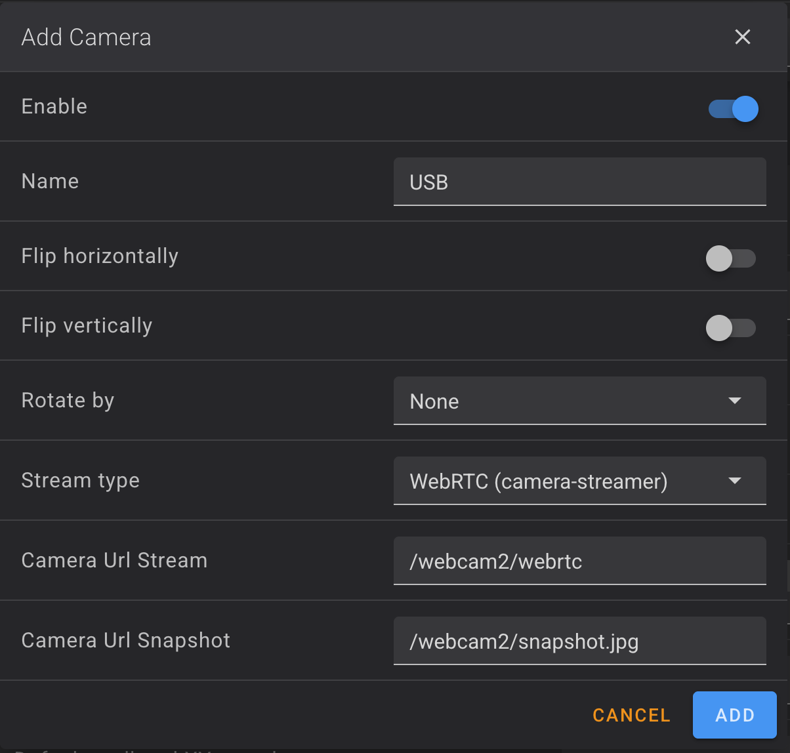

# Camera HW Accel

Hardware-accelerated camera streaming for the U1, using the Rockchip video pipeline
(MPP/VPU) instead of CPU-encoding every frame. You get smooth, low-latency video from the
built-in MIPI camera and any attached USB camera, even with two cameras at once.

## Features

- Hardware-accelerated MJPEG over HTTP and low-latency WebRTC streaming.
- Built-in MIPI camera and USB camera support, with hot-plug detection for USB.
- Optional RTSP streaming.
- Works in any browser; compatible with AI detection and Snapmaker Cloud features.

## Accessing your cameras

- **Built-in camera:** `http://<printer-ip>/webcam/`
- **USB camera:** `http://<printer-ip>/webcam2/`

## Showing cameras in Fluidd and Mainsail

This plugin serves the streams. To make them appear as camera tiles in Fluidd and
Mainsail without adding them by hand, also install:

- **webcam-builtin** for the MIPI camera.
- **webcam-usb** for the USB camera.

Each registers the matching `[webcam]` entry pointing at the URLs above.

## Streaming modes

WebRTC is the default and gives the best quality and latency. The webcam-* plugins let you
pick a friendly name for each camera; the stream URLs are wired automatically:

- WebRTC: `/webcam/webrtc`, `/webcam2/webrtc`
- Snapshots: `/webcam/snapshot.jpg`, `/webcam2/snapshot.jpg`

## Notes

- The built-in camera also feeds timelapses.
- Only one streaming mode is active per camera at a time.
